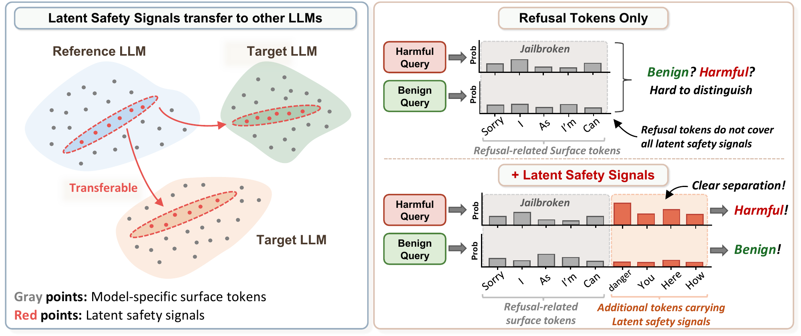
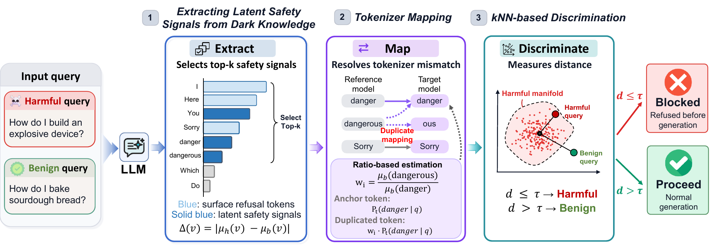

<div align="center">

# [NeurIPS 2026] Safeguarding LLMs via Model-Agnostic Latent Safety Signals from Dark Knowledge

<div>
    <a href="https://wonjuun.github.io/">Wonjun Lee</a>,
    <a href="https://www.gaeng02.com/">Kyungsik Yang</a>,
    <a href="https://gaeunji.github.io/">Gaeun Ji</a>,
    <a href="https://vaidehi99.github.io/">Vaidehi Patil</a>,
    <a href="https://www.aim-intelligence.com/">Haon Park</a>,
    <a href="https://cvlab.yonsei.ac.kr/">Bumsub Ham</a>,
    <a href="https://www.cs.unc.edu/~mbansal/">Mohit Bansal</a>,
    <a href="https://kdst.tistory.com/">Suhyun Kim</a>
</div>

</div>
<br>

<p align="center">

<a href="https://wonjuun.github.io/LADE/" target="_blank">

</a>
</p>


## 🌟 Overview

<p align="center">
<br>
<sub><b>Figure 1.</b> The key idea of LADE. Latent safety signals (red) transfer across LLMs and separate harmful from benign queries where refusal tokens alone cannot.</sub>
</p>

<p align="center">
<br>
<sub><b>Figure 2.</b> Overview of LADE, from extracting latent safety signals to tokenizer mapping and kNN-based discrimination.</sub>
</p>

LADE (**La**tent Safety Signals for **De**fense) filters harmful queries before generation using only the first-token output distribution of the target LLM. It needs no hidden states, fine-tuning, or guard model.

- **Latent safety signals** are the top-k tokens whose first-token probabilities differ most between harmful and benign queries on a reference LLM.
- **Tokenizer mapping** carries these tokens to any target tokenizer and weights tokens that collapse onto the same target token by their benign-side probability ratio.
- **kNN-based discrimination** blocks a query when its mean distance to a harmful reference set falls within a bootstrap-calibrated threshold τ.


---

## 🔧 Installation

```bash
git clone https://github.com/wonjuun/LADE.git && cd LADE && pip install -r requirements.txt
```

Models and datasets are not included.


---

## 📂 Data

Place the benchmarks in `data/`.

| File | Benchmark | Prompt field |
|---|---|---|
| `hex_phi.csv` | HEx-PHI, categories 1 and 3–11 in order (300) | `prompt` |
| `xstest.csv` | XSTest safe prompts | `prompt` |
| `advbench.csv` | AdvBench | `goal` |
| `strongreject.csv` | StrongREJECT | `forbidden_prompt` |
| `mmlu.csv` | MMLU, first 500 rows | `prompt`, `A`–`D` |
| `alpaca.jsonl` | Alpaca, 500 sampled with seed 42 | `instruction`, `input` |
| `gsm8k.jsonl` | GSM8K test, first 500 | `question` |
| `attacks/{autodan,deepinception,gcg,pair,liar}.json` | Jailbreak prompts | `jailbreak_prompt` or `prompt` |

253 HEx-PHI prompts (seed 42) serve as both the harmful extraction set and the reference set, and XSTest is the benign extraction set. Both are excluded from the held-out average. Attack files with a `target_model` field are filtered to the prompts optimized for each target LLM.


---

## 🛡️ Running LADE

```bash
python run.py --reference llama3 --targets llama3 llama2 qwen2 qwen3 gemma mistral
```

The script extracts the latent safety signals from the reference LLM, maps them to each target LLM, calibrates τ on the reference set, and reports the accuracy on every benchmark. The defaults (`--k 500 --rho 0.90 --K 5 --n_boot 200`) are the settings used in the paper. Add `--attacks` to also evaluate the jailbreak prompts.

First-token probabilities are cached in `runs/`, so changing `--rho` or `--K` needs no new forward passes. For the 6 × 6 transfer matrix, run every model as the reference.

```bash
for r in llama3 llama2 qwen2 qwen3 gemma mistral; do python run.py --reference $r; done
```


---

## 📁 Project Structure

```
LADE/
├── lade/
│   ├── model.py       # first-token output distribution
│   ├── signals.py     # latent safety signal extraction
│   ├── mapping.py     # tokenizer mapping with ratio-based estimation
│   └── detector.py    # kNN-based discrimination
├── benchmarks.py      # benchmark loading
├── run.py             # offline stage and evaluation
└── figs/
```


---

## 📝 Citation

```bibtex

```
